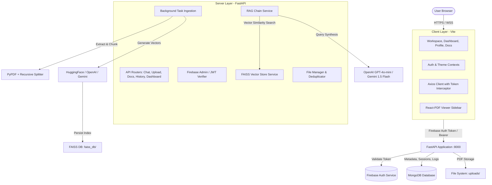

# 🧠 DocuMind AI — Intelligent PDF Assistant

[](https://fastapi.tiangolo.com/)
[](https://react.dev/)
[](https://www.typescriptlang.org/)
[](https://www.python.org/)
[](https://www.mongodb.com/)
[](https://github.com/facebookresearch/faiss)
[](https://firebase.google.com/)

**DocuMind AI** is an enterprise-grade, multi-tenant Retrieval-Augmented Generation (RAG) platform that empowers users to upload, analyze, and interactively interrogate PDF documents with pinpoint accuracy. It combines a high-performance **FastAPI** backend with an intuitive, responsive **React 19 + TypeScript** frontend, featuring interactive split-screen PDF previewing, contextual source citations, flexible LLM and embedding backends (OpenAI / Google Gemini / HuggingFace), and comprehensive workspace analytics.

---

## 📑 Table of Contents

- [Key Features](#-key-features)
- [System Architecture](#-system-architecture)
- [Frontend Overview](#-frontend-overview)
  - [Tech Stack](#frontend-tech-stack)
  - [Key Views & Pages](#frontend-pages--views)
  - [Directory Structure](#frontend-directory-structure)
  - [Setup & Run](#frontend-setup--run)
  - [Environment Variables](#frontend-environment-variables)
- [Backend Overview](#-backend-overview)
  - [Tech Stack](#backend-tech-stack)
  - [Core Services & Capabilities](#backend-services--capabilities)
  - [Directory Structure](#backend-directory-structure)
  - [API Endpoints Reference](#api-endpoints-reference)
  - [Setup & Run](#backend-setup--run)
  - [Environment Variables](#backend-environment-variables)
- [End-to-End Getting Started Guide](#-end-to-end-getting-started-guide)
- [Multi-Tenancy & Security](#-multi-tenancy--security)
- [License](#-license)

---

## 🚀 Key Features

- **Multi-Tenant User Isolation**: Strict data segregation per user using Firebase Authentication and scoped MongoDB queries.
- **Dynamic Dual LLM & Embeddings**: Seamlessly switch between OpenAI (`gpt-4o-mini`) and Google Gemini (`gemini-1.5-flash`), with vector embedding choices across HuggingFace (`all-MiniLM-L6-v2`), OpenAI (`text-embedding-3-small`), or Google Gemini.
- **Split-View Workspace**: Side-by-side interactive PDF reader (powered by `react-pdf` and `react-resizable-panels`) and conversational AI assistant.
- **Accurate Source Attributions**: AI responses highlight matching document chunks, page numbers, and snippet quotes for verification.
- **Asynchronous Background Ingestion**: Non-blocking document processing for large PDFs with real-time job status polling.
- **Deduplication via Hash Fingerprinting**: Prevents redundant embeddings by hashing document content prior to parsing.
- **Session & Conversation Management**: Create, rename, pin, switch, and delete chat threads with automated persistent conversation history.
- **Search History & Document Filtering**: Retain searchable historical queries with date-range and document-level filters.
- **User Dashboard & Storage Analytics**: Real-time monitoring of uploaded files, storage quotas (up to 500 MB limit), question counts, and 7-day usage trends.
- **Theme Customization**: Sleek dark and light mode UI with glassmorphic accents and smooth micro-animations.

---

## 🏛 System Architecture



---

## 💻 Frontend Overview

The frontend is a single-page application built on **React 19**, **TypeScript**, and **Vite**, focusing on productivity, responsiveness, and fluid document interaction.

### Frontend Tech Stack

- **Framework**: React 19 (`react`, `react-dom`)
- **Language**: TypeScript 6
- **Build Tool**: Vite 8
- **Routing**: React Router DOM v7 (`HashRouter`)
- **PDF Rendering**: `react-pdf` (with PDF.js worker)
- **Layout & Resizing**: `react-resizable-panels`
- **Icons**: `lucide-react`
- **HTTP Client**: `axios` (with caching, deduplication, and auth token injection)
- **Authentication**: Firebase Client SDK v12

### Frontend Pages & Views

| Page | Route | Description |
| :--- | :--- | :--- |
| **Landing Page** | `/` | Hero section, feature showcase, architecture overview, and CTA entry points. |
| **Login Page** | `/login` | Google OAuth sign-in and local mock developer login for testing without Firebase credentials. |
| **Workspace Page** | `/app` | Main dual-pane workspace containing the split PDF viewer, session manager, and RAG chat interface. |
| **Documents Page** | `/documents` | Grid and list views of uploaded PDFs, file sizes, page counts, reindex triggers, and deletion actions. |
| **Dashboard Page** | `/dashboard` | Metrics dashboard showing storage usage, total queries, active documents, and 7-day usage charts. |
| **Search History**| `/history` | Auditable query logs with full-text search, date filters, and per-query deletion. |
| **Profile Page** | `/profile` | Account settings, display name, user avatar update, and activity breakdown. |

### Frontend Directory Structure

```plaintext
frontend/
├── index.html              # HTML shell with Google Fonts
├── package.json            # Scripts and frontend dependencies
├── tsconfig.json           # TypeScript configuration
├── src/
│   ├── App.tsx             # Route declarations & ProtectedRoute wrappers
│   ├── main.tsx            # DOM initialization & React root
│   ├── index.css           # Global design system, utility classes, themes
│   ├── components/         # Reusable UI components
│   │   ├── ChatMessage.tsx         # Render user/assistant bubbles with source tags
│   │   ├── ChatSidebar.tsx         # Session list, pin/rename/delete actions
│   │   ├── OnboardingHero.tsx      # Empty state hero with suggested questions
│   │   ├── PDFViewerSidebar.tsx    # Split-view canvas PDF reader with pagination
│   │   ├── ProtectedRoute.tsx      # Auth gate guarding private routes
│   │   ├── SuggestedPrompts.tsx    # Context-aware starter queries
│   │   ├── ThemeSwitcher.tsx       # Dark / Light theme toggle
│   │   ├── UploadDrawer.tsx        # Drag-and-drop file upload drawer
│   │   └── UserMenu.tsx            # Header avatar dropdown & navigation
│   ├── contexts/           # React contexts
│   │   ├── AuthContext.tsx         # Firebase auth listener & mock login state
│   │   └── ThemeContext.tsx        # Dark/light theme state manager
│   ├── lib/
│   │   └── firebase.ts     # Firebase client configuration & initialization
│   ├── pages/              # Top-level view containers (Workspace, Dashboard, etc.)
│   └── services/
│       └── api.ts          # Centralized Axios client with in-memory request caching
```

### Frontend Setup & Run

1. **Navigate to the frontend folder**:
   ```bash
   cd frontend
   ```

2. **Install dependencies**:
   ```bash
   npm install
   ```

3. **Configure Environment Variables**:
   Copy the example file and update with your Firebase credentials:
   ```bash
   cp .env.example .env
   ```

4. **Run Development Server**:
   ```bash
   npm run dev
   ```
   The client will be running at `http://localhost:5173`.

5. **Build for Production**:
   ```bash
   npm run build
   npm run preview
   ```

### Frontend Environment Variables

Create a `frontend/.env` file with the following variables:

```env
# Backend API Base URL
VITE_API_URL=http://localhost:8000

# Firebase Client Configuration (Firebase Console -> Project Settings)
VITE_FIREBASE_API_KEY=your_firebase_api_key
VITE_FIREBASE_AUTH_DOMAIN=your_project.firebaseapp.com
VITE_FIREBASE_PROJECT_ID=your_project_id
VITE_FIREBASE_STORAGE_BUCKET=your_project.firebasestorage.app
VITE_FIREBASE_MESSAGING_SENDER_ID=your_sender_id
VITE_FIREBASE_APP_ID=your_app_id
```

---

## ⚙️ Backend Overview

The backend is built with **FastAPI** to deliver high-throughput, low-latency document processing and retrieval endpoints. It integrates LangChain and FAISS for vector indexing and supports pluggable LLM and embedding backends.

### Backend Tech Stack

- **Web Framework**: FastAPI `>=0.110.0`
- **ASGI Server**: Uvicorn `>=0.28.0`
- **Data Validation & Settings**: Pydantic v2 & Pydantic-Settings
- **PDF Extraction**: PyPDF `>=4.0.0`
- **Vector Database**: FAISS (CPU) `>=1.8.0`
- **Orchestration**: LangChain & LangChain Community
- **LLM Integrations**: `langchain-openai`, `langchain-google-genai`
- **Local Embeddings**: `sentence-transformers` (`all-MiniLM-L6-v2`)
- **Metadata Database**: MongoDB (via `pymongo` & `motor`)
- **Security & Auth**: `firebase-admin`, `PyJWT`

### Backend Services & Capabilities

- **`PDFLoaderService` (`app/services/pdf_loader.py`)**: Extracts page-by-page text with metadata annotations (page numbers, source filenames).
- **`TextSplitterService` (`app/services/text_splitter.py`)**: Chunks documents using `RecursiveCharacterTextSplitter` with customizable `CHUNK_SIZE=2000` and `CHUNK_OVERLAP=100`.
- **`EmbeddingService` (`app/services/embedding_service.py`)**: Factory for HuggingFace, OpenAI, or Google Gemini embedding models.
- **`VectorStoreService` (`app/services/vector_store.py`)**: Manages isolated FAISS indexes on disk, supports adding documents, similarity search, and index reset per user.
- **`RAGChainService` (`app/services/rag_chain.py`)**: Executes contextual question-answering with conversational memory synthesis and source provenance.
- **`BackgroundProcessor` (`app/services/background_processor.py`)**: Handles document indexing asynchronously in background worker tasks.
- **`JobStore` (`app/services/job_store.py`)**: In-memory job state tracking for background ingestion status polling.
- **`FileService` (`app/services/file_service.py`)**: Validates MIME types, restricts file sizes (up to 100 MB per file, max 5 files per upload), and removes physical files upon document deletion.
- **`MongoDBManager` (`app/database.py`)**: Connection pooling and automatic index creation for 6 collections: `users`, `documents`, `chat_sessions`, `chat_messages`, `kb_metadata`, and `search_history`.

### Backend Directory Structure

```plaintext
backend/
├── requirements.txt        # Python package dependencies
├── .env.example            # Environment configuration template
├── uploads/                # Local storage for uploaded PDF files
├── faiss_db/               # Persistent FAISS vector indexes
├── logs/                   # Application log files
└── app/
    ├── main.py             # FastAPI entrypoint, middleware, routers, exception handlers
    ├── config.py           # Pydantic Settings management with defaults
    ├── auth.py             # Firebase token authentication & dev fallback decoder
    ├── database.py         # MongoDB connection manager, schema, and indexes
    ├── dependencies.py     # FastAPI dependency injections (user, db, services)
    ├── api/                # API Route Handlers
    │   ├── health.py       # API and MongoDB health check endpoints
    │   ├── upload.py       # Multi-file PDF upload and background indexing
    │   ├── chat.py         # Conversational RAG question-answering endpoint
    │   ├── chat_history.py # Session CRUD, message logs, pin/rename endpoints
    │   ├── documents.py    # Document list, metadata, download, reindex, delete
    │   ├── dashboard.py    # Metrics aggregation and 7-day usage analytics
    │   ├── history.py      # Search query log retrieval and clearing
    │   ├── profile.py      # User profile retrieval and statistics
    │   └── reset.py        # Clear personal vector index and MongoDB records
    ├── middleware/
    │   └── cors.py         # Cross-Origin Resource Sharing configuration
    ├── models/             # Pydantic request and response schemas
    │   ├── chat_models.py
    │   ├── document_models.py
    │   └── response_models.py
    ├── services/           # Business logic and RAG service layers
    └── utils/              # Logging formatters, hashing, and helpers
```

### API Endpoints Reference

| Method | Endpoint | Description | Auth Required |
| :--- | :--- | :--- | :---: |
| `GET` | `/health` | Application status health check | No |
| `GET` | `/health/database` | MongoDB connection status and collection count | No |
| `POST` | `/upload` | Upload up to 5 PDFs (max 100MB each) for indexing | Yes |
| `GET` | `/upload-status/{job_id}` | Check background processing progress | Yes |
| `POST` | `/chat` | Submit question with conversation history | Yes |
| `GET` | `/documents` | List all indexed documents for authenticated user | Yes |
| `GET` | `/documents/{doc_id}` | Retrieve metadata for a specific document | Yes |
| `GET` | `/documents/{doc_id}/download` | Stream physical PDF file to the browser | Yes |
| `POST` | `/documents/{doc_id}/reindex` | Re-extract text and regenerate embeddings | Yes |
| `DELETE` | `/documents/{doc_id}` | Delete document file, metadata, and FAISS vectors | Yes |
| `GET` | `/chat-sessions` | List user conversation sessions (pinned first) | Yes |
| `POST` | `/chat-sessions` | Create a new conversation session | Yes |
| `PUT` | `/chat-sessions/{id}/rename` | Rename chat session title | Yes |
| `PUT` | `/chat-sessions/{id}/pin` | Pin or unpin a conversation session | Yes |
| `DELETE` | `/chat-sessions/{id}` | Delete chat session and its message logs | Yes |
| `GET` | `/chat-sessions/{id}/messages` | Retrieve full message thread with sources | Yes |
| `GET` | `/dashboard` | User overview metrics, storage usage, 7-day trends | Yes |
| `GET` | `/history` | Filterable query search history log | Yes |
| `DELETE` | `/history/{id}` | Delete single search history log entry | Yes |
| `DELETE` | `/history` | Clear all search query logs for the user | Yes |
| `GET` | `/profile` | User profile stats, total uploads, questions count | Yes |
| `PUT` | `/profile` | Update user display name and profile picture URL | Yes |
| `POST` | `/clear-db` | Reset personal knowledge base, files, and vectors | Yes |

### Backend Setup & Run

1. **Navigate to the backend directory**:
   ```bash
   cd backend
   ```

2. **Create and activate a Python virtual environment**:
   ```bash
   # Windows (PowerShell)
   python -m venv venv
   .\venv\Scripts\Activate.ps1

   # Linux / macOS
   python3 -m venv venv
   source venv/bin/activate
   ```

3. **Install dependencies**:
   ```bash
   pip install -r requirements.txt
   ```

4. **Configure Environment Variables**:
   ```bash
   cp .env.example .env
   ```
   *Edit `.env` to configure your LLM provider, API keys, and MongoDB connection string.*

5. **Start the FastAPI server**:
   ```bash
   uvicorn app.main:app --host 0.0.0.0 --port 8000 --reload
   ```
   Interactive Swagger documentation is available at `http://localhost:8000/docs`.

### Backend Environment Variables

Configure your `backend/.env` file using these key options:

```env
# ==========================================
# LLM Provider Configuration ('openai' or 'gemini')
# ==========================================
LLM_PROVIDER=openai

# OpenAI Configuration
OPENAI_API_KEY=sk-proj-your-openai-key
OPENAI_LLM_MODEL=gpt-4o-mini
OPENAI_EMBEDDING_MODEL=text-embedding-3-small

# Google Gemini Configuration
GOOGLE_API_KEY=your_gemini_api_key
GEMINI_LLM_MODEL=gemini-1.5-flash
GEMINI_EMBEDDING_MODEL=models/gemini-embedding-2

# ==========================================
# Embedding Provider ('huggingface', 'openai', or 'gemini')
# ==========================================
EMBEDDING_PROVIDER=huggingface
EMBEDDING_MODEL=sentence-transformers/all-MiniLM-L6-v2

# ==========================================
# RAG Hyperparameters
# ==========================================
CHUNK_SIZE=2000
CHUNK_OVERLAP=100
TOP_K=5

# ==========================================
# Storage Limits
# ==========================================
MAX_FILE_SIZE_MB=100
MAX_FILES_PER_UPLOAD=5
TOTAL_UPLOAD_LIMIT_MB=500

# ==========================================
# MongoDB & Authentication
# ==========================================
MONGODB_URI=mongodb://localhost:27017
DATABASE_NAME=documind_ai
FIREBASE_PROJECT_ID=your_firebase_project_id
JWT_SECRET_KEY=your-secure-jwt-secret-key
```

---

## 🛠 End-to-End Getting Started Guide

Follow this guide to run both backend and frontend locally in development mode:

### Step 1: Clone the Repository
```bash
git clone https://github.com/Krunalsinh0707/DocuMind-AI---Intelligent-PDF-Assistant.git
cd DocuMind-AI---Intelligent-PDF-Assistant
```

### Step 2: Set Up MongoDB
Ensure a local MongoDB instance is running or use a free MongoDB Atlas connection:
```bash
# Verify local MongoDB connection (default port 27017)
mongosh mongodb://localhost:27017
```

### Step 3: Launch Backend
```bash
cd backend
python -m venv venv
.\venv\Scripts\Activate.ps1   # Or 'source venv/bin/activate' on Mac/Linux
pip install -r requirements.txt
cp .env.example .env
# Edit .env and supply your OPENAI_API_KEY or GOOGLE_API_KEY
uvicorn app.main:app --port 8000 --reload
```

### Step 4: Launch Frontend
Open a second terminal window:
```bash
cd frontend
npm install
cp .env.example .env
npm run dev
```

### Step 5: Access the Application
1. Open your browser at `http://localhost:5173`.
2. Click **Get Started** or **Login**.
3. You can authenticate using **Google OAuth** (if Firebase is configured) or click **Dev Mode Login** to sign in instantly with a local development identity.
4. Upload a PDF, ask questions in the chat, and view matching source pages in the embedded PDF reader.

---

## 🔒 Multi-Tenancy & Security

DocuMind AI implements multi-layered security controls to guarantee tenant privacy:

1. **Token Authentication**:
   - Every incoming request carries a Firebase ID token in the `Authorization: Bearer <token>` header.
   - The backend validates tokens using the `firebase-admin` SDK or dev-fallback JWT decoder.
2. **User-Scoped Vector Storage**:
   - Vector chunks in FAISS and documents on disk are isolated by unique IDs linked to the authenticated user UID.
3. **Database Isolation**:
   - All MongoDB queries against `documents`, `chat_sessions`, `chat_messages`, and `search_history` enforce mandatory `{ "user_id": current_user["id"] }` filtering to prevent data leakage across users.
4. **File Validation**:
   - Uploaded files are checked for MIME type integrity (`application/pdf`), sanitized to prevent directory traversal, and hashed with SHA-256 to reject duplicate payloads.

---

## 📄 License

This project is licensed under the MIT License — see the [LICENSE](LICENSE) file for details.
